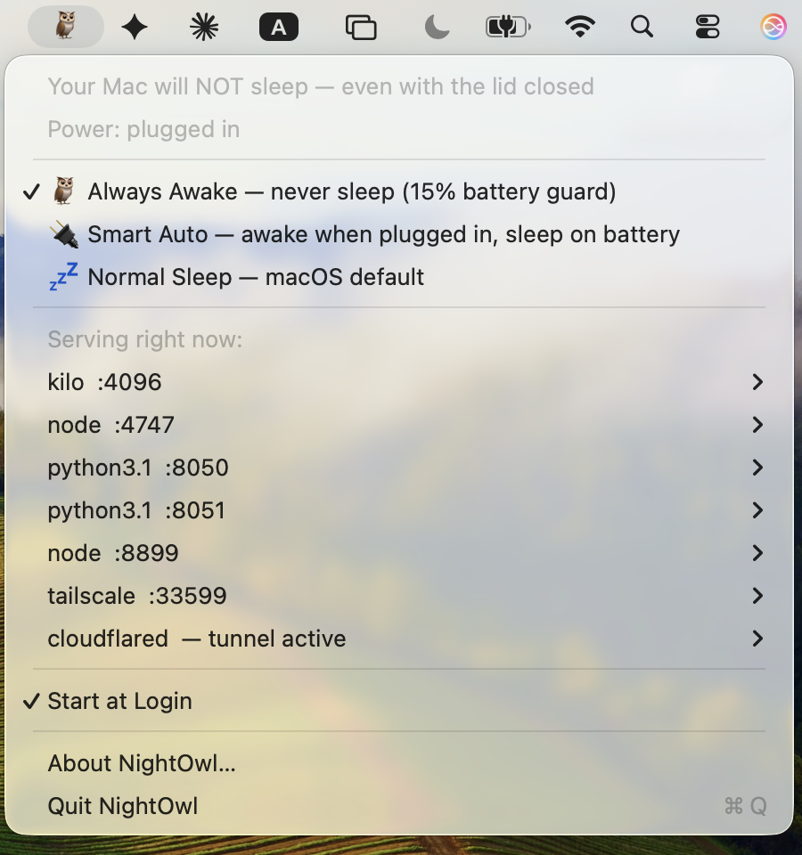

# NightOwl 🦉

[](https://github.com/taufiqxr/NightOwl/actions/workflows/ci.yml)

A tiny macOS menu bar app that keeps your Mac awake — **even with the lid
closed** — and tells you what it's staying awake *for*: it lists the local
servers and tunnels the Mac is hosting, and can watch any of them,
alerting you the moment one goes down and again when it's back.

Perfect for running bots, agents, home servers, long downloads, or anything
else that needs a Mac awake 24/7 — **turn a MacBook you already own into an
always-on machine, no Mac mini required.**




## Why NightOwl exists

If you run anything on a MacBook that needs to stay alive (a home server, a
bot, a long download, a build), closing the lid kills it: macOS **force-sleeps**
a MacBook on lid close unless it's docked to both AC power *and* an external
display. Popular keep-awake tools — `caffeinate`, Amphetamine, and friends —
**cannot prevent this**. Their power assertions only stop *idle* sleep; the
forced clamshell sleep ignores them entirely.

The only switch that survives a lid close is macOS's own
`pmset disablesleep`, which requires admin rights and is easy to misuse
(a Mac that *never* sleeps will happily cook in a backpack). NightOwl wraps
it in a menu bar app with three explicit modes and an always-visible status.

## What you see

The menu bar icon expresses the full state at a glance:

| Icon | Meaning |
|---|---|
| 🦉 | Your Mac will *not* sleep, lid closed or not — all well |
| 🦉⚠️ | Awake, but a watched service is down or the daemon isn't running |
| 🪫 | The low-battery guard has tripped — sleep allowed until charging |
| 💤 | Normal sleep mode; closing the lid sleeps the Mac |
| 💤⚠️ | Sleep allowed *and* a watched service is down |

Hover for a tooltip naming the exact condition. The icon reflects the
*actual* system state (checked every 10 seconds), not just what NightOwl
last did — so it stays honest even if something else changes the setting.

## Modes

| Mode | Behavior | Use it when |
|---|---|---|
| 🦉 **Always Awake** | Never sleeps, plugged in or on battery — with a **low-battery guard**: below 15% on battery, normal sleep is restored so a forgotten Mac can't run itself flat (re-arms at 18% or on the charger) | The Mac is a stationary appliance that occasionally goes mobile. |
| 🔌 **Smart Auto** | Awake whenever plugged in; normal sleep on battery | Set-and-forget. Bag-safe by construction: unplugged = normal sleep. |
| 💤 **Normal Sleep** | The macOS default | You want stock behavior back. |

The menu always shows the live status, the power source, and — when on
battery — the current charge percentage.

## The Servers menu

A single **Servers (N)** item lists what the always-awake Mac is actually
hosting — the servers you're keeping it awake *for* — expanding on hover
so the main menu stays clean (the item shows a ⚠️ badge when something
watched is down). Every listening local service (a node dev server, a
Flask app, anything with an open TCP port) appears with its ports; hover
one for a submenu with its PID and per-port
**Open http://localhost:PORT** / **Copy URL** actions. Tunnel clients
(`cloudflared`, `ngrok`) are detected by process, since tunnels dial out
rather than listen.

Design choices worth knowing:

- Detection runs **only when you open the menu** (one `lsof` call) — zero
  idle cost.
- System and browser listeners (AirPlay, `rapportd`, Chrome casting, …)
  are filtered out so the list is your servers, not OS noise.
- Only **process name, port, and PID** are shown — never command lines.
  Command lines can carry secrets (a `cloudflared` tunnel token, for
  example), and a menu should never display one.
- Servers running **as root** aren't visible (detection uses your user
  session's `lsof`) — known limitation.

### Claude

If you use [Claude Code](https://claude.com/claude-code), a **Claude (N)**
item lists every open session by its **session name** (the one you set
with `/rename`, or the auto-generated one) with its project folder — so
even several terminals in the same folder are distinguishable — and a ⚡
marks sessions actively working right now. Hover one for the full path,
PID, tty, busy/idle, running time, and **Jump to this terminal** (brings
that Terminal.app/iTerm2 tab to the front — first use asks for macOS's
automation permission), plus **Reveal in Finder** / **Copy path**. Names
come from Claude Code's own local session files; nothing leaves the
machine. The section disappears entirely when no sessions are running.

### Watching services

Click **Watch** in any service's submenu and NightOwl checks it every 60
seconds, posting a macOS notification when it goes down and another when
it comes back — so an always-awake Mac can't silently become a uselessly
awake Mac. Watches survive service restarts and app relaunches (identity
is the port, not the PID), a downed watched service stays visible in the
menu marked **⚠️ DOWN** until you unwatch it, and the first check after a
relaunch primes silently so services that just haven't started yet don't
false-alarm.

NightOwl also notifies when the **low-battery guard** acts (trip and
re-arm) and when the sleep setting is changed *outside* NightOwl. Smart
Auto's routine plug/unplug transitions stay silent by design. All of this
respects the system notification permission — denying it keeps NightOwl
quiet.

Every mode change asks for your admin password via the standard macOS
dialog — that's macOS protecting the power switch, not NightOwl phoning home.

## Install

### Option A — build from source (recommended)

Requires the Xcode Command Line Tools (`xcode-select --install`), macOS 13+.

```bash
git clone https://github.com/taufiqxr/NightOwl.git
cd NightOwl
./build.sh --install
```

That compiles, installs to `/Applications`, and launches it. NightOwl adds
itself to your Login Items on first run (toggle it off in the menu anytime).

### Option B — download the app directly

Grab `NightOwl-<version>.zip` from the
[Releases page](https://github.com/taufiqxr/NightOwl/releases).
Unzip, drag `NightOwl.app` to `/Applications`, then **right-click → Open**
the first time (it's not notarized with a paid Apple developer account, so
Gatekeeper needs the explicit right-click → Open once). If macOS still
refuses, clear the download quarantine flag:

```bash
xattr -dr com.apple.quarantine /Applications/NightOwl.app
```

To create that zip from source: `./build.sh --release` → `dist/NightOwl-<version>.zip`.

## How it works (and what runs as root)

Transparency matters for a tool that asks for your password, so here is the
complete list of what NightOwl does with admin rights:

- **Always Awake** and **Smart Auto** install a small root LaunchDaemon
  (`/Library/LaunchDaemons/com.nightowl.auto.plist` +
  `/usr/local/bin/nightowl-auto.sh` — ~40 lines of shell you can read in
  `Resources/`) that checks the power state every 20 seconds:
  - in **auto** mode: AC → `disablesleep 1`, battery → `disablesleep 0`;
  - in **always** mode: `disablesleep 1` everywhere, except the
    low-battery guard — at ≤15% on battery it runs `disablesleep 0`
    (re-arming at ≥18% or on AC). The guard runs as root precisely so it
    works *unattended* — no password prompt when the Mac is forgotten in
    a bag.
- **Normal Sleep** removes the daemon and runs `pmset -a disablesleep 0`.
- Switching modes always removes the daemon first, so it can never fight
  the new choice.
- When the daemon restores sleep permission while the lid is already
  closed (guard trip in a bag, or unplugging a closed Smart Auto Mac),
  it puts the Mac to sleep immediately (`pmset sleepnow`) instead of
  waiting for macOS to get around to it.
- The daemon logs every state change (one line each — tiny volume) to:
  ```bash
  tail /var/log/nightowl.log
  ```
- The menu self-checks the daemon: if the process has died, or an app
  update shipped a newer daemon script than the one installed, the menu
  shows a one-click repair/update item. The daemon's decision logic is
  covered by [mock-based tests](tests/test-daemon-logic.sh) run in CI on
  every push.

Nothing else. No network access, no analytics, no background helpers beyond
the one daemon Smart Auto installs (and removes when you leave that mode).

`disablesleep` persists across reboots; whatever mode you pick stays picked.

## FAQ

**My screen still turns off and locks when I close the lid — is it even
working?**
Yes — that's the design. The *display* sleeps and locks; the *machine* keeps
running. Check the menu bar icon (🦉 = awake) or run
`pmset -g | grep SleepDisabled` — `1` means every server, download, and
script is still going with the lid shut.

**Will Always Awake drain my battery?**
It will use it, yes — unplugged, the Mac stays fully on. But it won't run
itself flat: the built-in guard restores normal sleep below 15% battery
(and re-arms once you're back on the charger or above 18%). If your Mac
travels a lot, 🔌 **Smart Auto** is still the better fit: normal sleep the
moment you unplug.

**How do I verify what state my Mac is in right now?**
```bash
pmset -g | grep SleepDisabled   # 1 = won't sleep, 0 = sleeps normally
```
The menu bar icon shows the same thing live (🦉 / 💤), and it reflects the
actual system state — not just what NightOwl last did.

**Why does it need my admin password?**
`pmset disablesleep` is a root-level power switch — macOS itself requires
admin rights for it. NightOwl asks through the standard macOS dialog and the
[How it works](#how-it-works-and-what-runs-as-root) section lists every
command it runs with those rights.

**Does the Mac wake up fine afterward?**
Nothing about wake changes — open the lid or press a key as usual. NightOwl
only controls whether the Mac is *allowed* to sleep.

## Uninstall

```bash
./uninstall.sh
```

Quits the app, removes the Smart Auto daemon if present, restores normal
sleep (`disablesleep 0`), and deletes `/Applications/NightOwl.app`.

## Releasing (maintainers)

Releases are driven by [CHANGELOG.md](CHANGELOG.md):

1. Bump `CFBundleShortVersionString` / `CFBundleVersion` in
   `Resources/Info.plist` (the app and release tooling both read it from
   there — no other version to touch).
2. Add a `## [<version>] — <date>` section to `CHANGELOG.md` describing
   what changed.
3. Commit, then run `./scripts/release.sh` — it refuses to ship without a
   matching changelog section, a clean pushed tree, and passing tests,
   then builds the zip and publishes the GitHub release using that
   changelog section as the release notes.

## Requirements

- macOS 13 Ventura or later (Apple Silicon or Intel)
- An admin account (mode changes use the macOS admin-password dialog)

## License

MIT — see [LICENSE](LICENSE).
